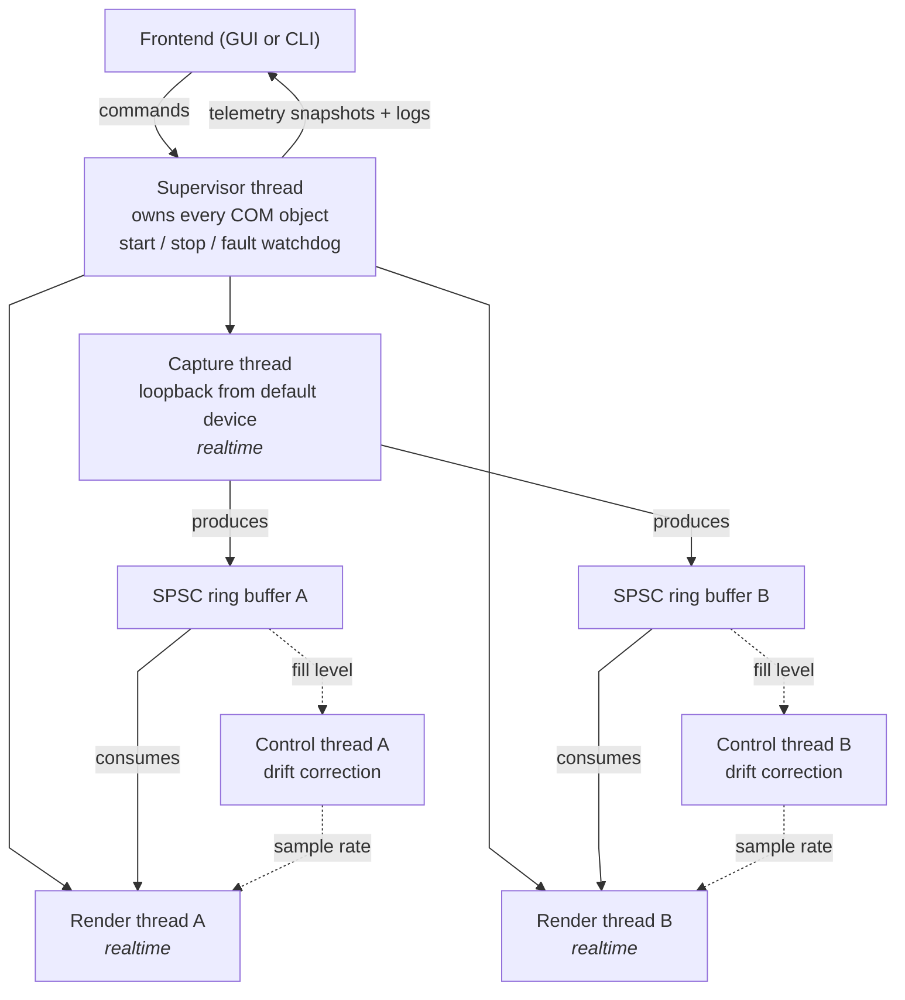

# MultiRoute (alias MultiMux)

> [!NOTE]
> Henceforth the project is referred to as MultiMux.

Play your Windows audio through several output devices at once, in sync, with separate delay and volume for each one.

Windows only lets you use one output device at a time, so if you want the same audio on your headphones and a Bluetooth speaker together, you're stuck. MultiMux takes whatever is already playing on your default device and sends a copy to any other outputs you pick, then keeps them lined up with each other.

Written in C++17 on top of WASAPI, with a Dear ImGui frontend.

---

## What it does

- **Several devices at once** — any number of active output endpoints, all fed from the same capture.
- **Clock sync** — no two device clocks run at exactly the same speed, so one gradually gets ahead of the others. Each device has a control loop watching how far its buffer has drifted from target and nudging its sample rate to compensate.
- **Per-device delay** — one output can be delayed than the rest which helps when something like a Bluetooth speaker lags behind wired headphones. Changeable while audio is playing.
- **Per-device volume** — separate levels, also changeable mid-playback.
- **Live telemetry** — buffer fill, applied clock rate, controller error and fault counts, per device.
- **Experiment mode** — a named session gets recorded to a log file: the settings you picked plus the telemetry over time, across as many steps as you want. It's to help you compare runs afterwards instead of tuning just by ear.

---

## How it fits together



The audio path and the control path don't share anything that can block them. Audio threads will never take a lock or allocate; the control and UI side do both freely.

### Files

```
src/
  AudioEngine.h/.cpp        Engine API and all the WASAPI code. The header has no Windows types in it.
  AudioRingBuffer.h         Lock-free SPSC byte FIFO.
  ClockDriftController.h    The drift correction math. 
  Logging.h                 Lock-free MPMC queue plus a drain thread. Safe to call from audio threads.
  ExperimentRecorder.h/.cpp Session recording. Only uses the public engine API.
  main_gui.cpp              ImGui frontend.
  main_cli.cpp              Console frontend.
  HelpText.h                In-app glossary. Plain data, editable without changing the UI code.
third_party/imgui/          Dear ImGui source (cloned separately, see below)
build/                      Generated. build/MultiMuxGui.exe is the self-contained app.
```

---

## Design

Almost everything here follows from two problems: device clocks drift apart from each other, and a render callback that misses its deadline turns into an audible dropout, so the audio threads can't be made to wait for anything.

**Buffers.** Each output gets its own SPSC ring buffer, with the capture thread writing and that device's render thread reading. I went with one buffer per device rather than one shared buffer with N readers, so a device that stalls only hurts itself and no output has to synchronise against another. Head and tail sit on separate cache lines, and they use acquire/release instead of `seq_cst`.

Only the consumer is allowed to move the read position, which mattered once I added live delay changes — shrinking a delay means throwing away audio that's already buffered. Instead of having the UI thread reach in and move the indices, the render thread does the discard itself when it notices an atomic request. The single-consumer rule then holds by construction and I don't have to remember it.

**Logging.** I wanted real diagnostics out of the audio threads, and that rules out anything which allocates, locks, or formats a string. So audio threads push a fixed-size POD record — an event ID plus two integers — into a lock-free MPMC queue, and a drain thread turns those into text for the UI. A slow log window therefore can't stall audio. If the queue fills up, records get dropped and counted, so at least the drop is visible instead of silent.

**Sync.** Each device has a non-realtime control thread running an EMA-smoothed proportional controller over its buffer fill error, driving `IAudioClockAdjustment::SetSampleRate`. There's a deadband so it ignores noise and a minimum step so it isn't calling into the OS constantly. For a while I had two hysteresis thresholds — 0.5 Hz inside the controller and 0.1 Hz in the caller — and the outer one could never actually fire, so there's one now.

**Telemetry.** `stats()` used to take the same mutex the supervisor holds while tearing devices down, which meant the GUI could block mid-restart. Now the supervisor builds an immutable snapshot and swaps in a pointer to it atomically, so readers never block. Volume changes still take a short lock, since dragging a slider is a handful of calls a second rather than one every frame.

**COM lifetimes.** WASAPI service objects care which thread acquires and releases them. `IAudioClient` and `IAudioClockAdjustment` therefore live on the supervisor thread, while the render and capture services are acquired and released inside the threads that use them. `start()` and `stop()` post a command to the supervisor and wait on it, so it doesn't matter which thread the UI calls them from.

**Changing delay while it's playing.** Increasing a delay is easy, since you can feed in silence and let the buffer grow. Decreasing it isn't, because audio already sitting in the buffer can't be un-played. Draining it with clock rate alone works out to roughly 40 seconds for 100 ms at the default correction range, which is useless in practice. I did look at temporarily widening the correction limits instead, but even a 20x boost only gets that down to about 2 seconds, and `SetSampleRate` returns `E_INVALIDARG` past some undocumented range that varies by endpoint — not something I wanted to build on.

What it does instead is split by size. Under 10 ms it just moves the controller's target and lets it walk there, which you don't hear. Anything larger mutes that one device, splices its buffer immediately, then unmutes — well under a second, and the other outputs keep playing throughout. Once the discontinuity is hidden behind a mute, there's no reason to converge gradually at all.

Delay is capped by ring capacity, which gets fixed when playback starts. The cap is worked out per device and shown in the UI, and a request past it is refused with a reason rather than quietly clamped.

**When things break.** Early on a render thread could die quietly while capture and the other devices carried on, so the only symptom was a slowly rising error count. Every fatal condition now routes through one function, and a config flag decides whether it takes the whole engine down — the default, because that's hardest to miss — or drops just the faulted device and lets the rest continue.

The one that actually caught me out: WASAPI's event-driven loopback capture stops signalling when the source device goes completely silent. Pause everything for a minute and the capture thread sits there waiting forever. The wait is bounded now, so silence turns into polling instead of a hang, and the count of those timeouts shows up in the telemetry.

---

## Getting it running

You'll need Visual Studio 2022 Build Tools and the Windows 10 SDK.

```
git clone --depth 1 https://github.com/ocornut/imgui.git third_party\imgui
build_gui.bat
```

Run that from a **Developer Command Prompt for VS 2022** and you'll get `build\MultiMuxGui.exe`.

The executable is self-contained: ImGui is compiled in, the C runtime is linked statically, and DirectX and WASAPI ship with Windows. So the source, ImGui and the VC++ Redistributable aren't needed to run it.

`build.bat` builds the console version instead, and `build_gui.bat clean` deletes the build folder.

From there:

1. Tick the outputs you want, set a delay and starting volume for each, then hit **Confirm**.
2. The live screen shows the telemetry, and delay and volume can both be changed from there while audio is playing.
3. **Logs** shows engine events, filtered by severity.
4. **Debug** asks for confirmation, then exposes the tuning parameters.
5. **Experiment** records a tuning session into `experiments/`.

**Help** explains every term in the UI in plain language.

A few things that aren't obvious:

- Your default output device is the one being captured, so it carries on playing by itself and can't also be a target. Its volume belongs to Windows rather than to this app.
- If you want audio going only to non-default devices, make something like VB-Cable your Windows default and pick the real devices as outputs.
- Loopback capture is shared-mode only, so an app holding an exclusive-mode stream can't be captured, and WASAPI blocks DRM-protected streams outright.
- It captures from whichever device was default when you pressed Confirm, and won't follow later changes to the Windows default.

---

## Limitations

- Currently, there's no recovery from unplugging a device — that output faults instead of reconnecting.
- It doesn't follow Windows default-device changes while running.
- Settings aren't saved between runs.
- The console frontend predates the volume and live-delay features, so it doesn't have them.
- The `experiments/` folder gets created wherever you ran the app from, rather than next to the executable.
